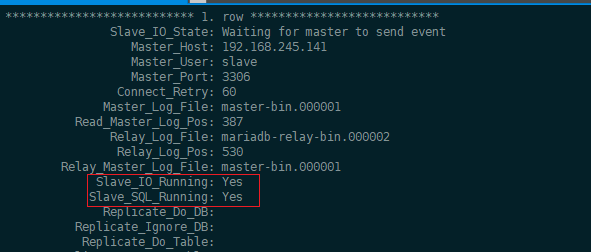

# mariadb主从搭建

## 准备

* [静态ip](https://github.com/karlsen2019/linux/blob/master/md/centos7%20%E9%9D%99%E6%80%81IP.md)
* [禁用防火墙](https://github.com/karlsen2019/linux/blob/master/md/centos7%20%E9%98%B2%E7%81%AB%E5%A2%99.md)
* [主机名](https://github.com/karlsen2019/linux/blob/master/md/centos7%20%E4%B8%BB%E6%9C%BA%E5%90%8D%E5%8F%8Aip%E6%98%A0%E5%B0%84.md)

## 安装mariadb

* [centos7安装mariadb](https://github.com/karlsen2019/linux/blob/master/md/centos7%20%E5%AE%89%E8%A3%85mariadb.md)

## 搭建maria主从

**主库配置**

* 开启binary log后重启mariadb`systemctl restart mariadb`
```
server-id=1
log_bin=master-bin
```
* 创建主从复制账户
```
GRANT REPLICATION SLAVE ON *.* TO 'slave'@'%' IDENTIFIED BY 'slave';
```
* 查看master信息：`show master status;`

  

**从库配置**

* 开启binary log后重启mariadb`systemctl restart mariadb`
  * server-id需与主库不同
```
server-id=2
log_bin=master-bin
```
* 执行主从挂载
  * 需对应
    * MASTER_LOG_FILE
    * MASTER_LOG_POS
```
CHANGE MASTER TO MASTER_HOST='192.168.245.136',MASTER_USER='slave',MASTER_PASSWORD='slave',MASTER_LOG_FILE='master-bin.000001',MASTER_LOG_POS=387;
```
* 开启主从：`start slave;`

* 查看主从挂载：`show slave status\G;`

  

**主从配置相关命令**

* 启动：`start slave;`
* 停止：`stop slave;`
* 重置：`reset slave;`